# Домашнее задание к занятию "`Teamcity`" - `Дедюрин Денис`

---
## Задание.

## Основная часть

1. Создайте новый проект в teamcity на основе fork.
1. Сделайте autodetect конфигурации.
1. Сохраните необходимые шаги, запустите первую сборку master.
1. Поменяйте условия сборки: если сборка по ветке master, то должен происходит mvn clean deploy, иначе mvn clean test.
1. Для deploy будет необходимо загрузить settings.xml в набор конфигураций maven у teamcity, предварительно записав туда креды для подключения к nexus.
1. В pom.xml необходимо поменять ссылки на репозиторий и nexus.
1. Запустите сборку по master, убедитесь, что всё прошло успешно и артефакт появился в nexus.
1. Мигрируйте build configuration в репозиторий.
1. Создайте отдельную ветку feature/add_reply в репозитории.
1. Напишите новый метод для класса Welcomer: метод должен возвращать произвольную реплику, содержащую слово hunter.
1. Дополните тест для нового метода на поиск слова hunter в новой реплике.
1. Сделайте push всех изменений в новую ветку репозитория.
1. Убедитесь, что сборка самостоятельно запустилась, тесты прошли успешно.
1. Внесите изменения из произвольной ветки feature/add_reply в master через Merge.
1. Убедитесь, что нет собранного артефакта в сборке по ветке master.
1. Настройте конфигурацию так, чтобы она собирала .jar в артефакты сборки.
1. Проведите повторную сборку мастера, убедитесь, что сбора прошла успешно и артефакты собраны.
1. Проверьте, что конфигурация в репозитории содержит все настройки конфигурации из teamcity.
1. В ответе пришлите ссылку на репозиторий.

### Ответ:
Развернуты 3 ВМ:

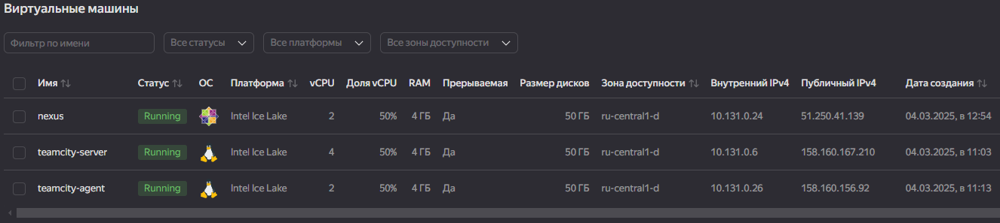

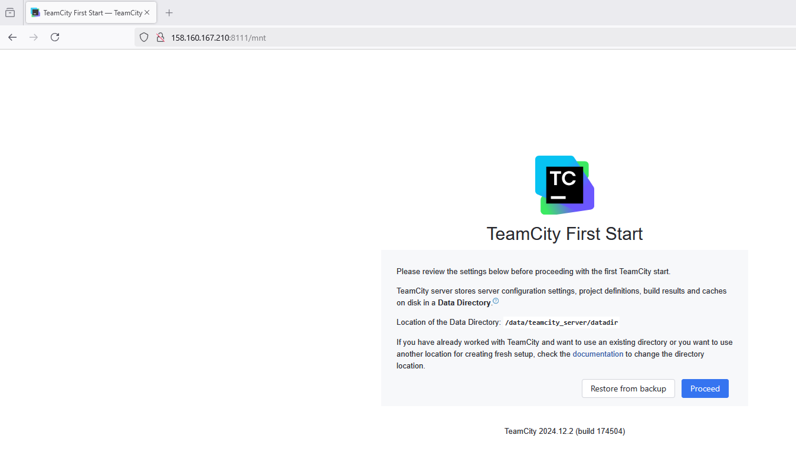

Установлен **nexus** с помощью **ansible-playbook** командой:
```
ansible-playbook -i inventory/cicd/hosts.yml site.yml
```
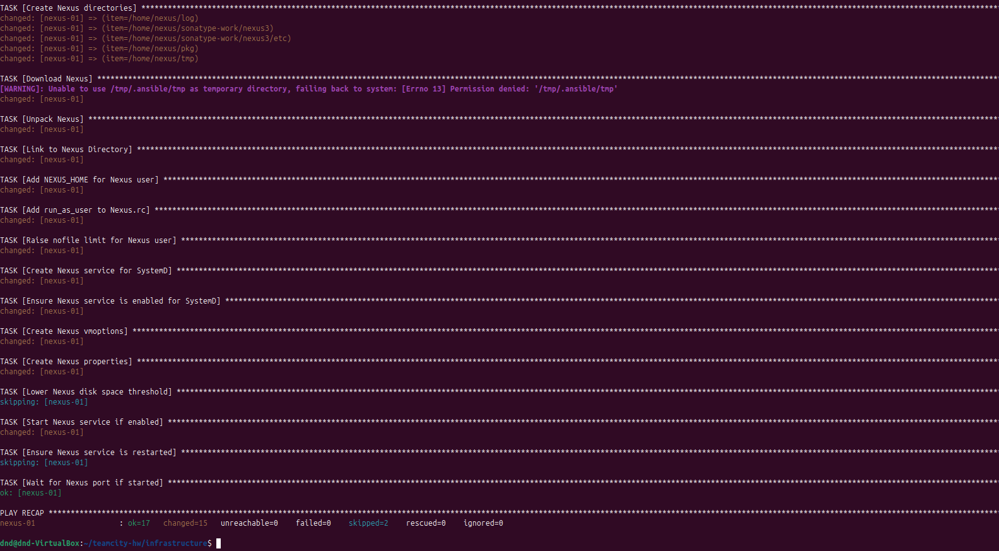

Создаем проект **netology**

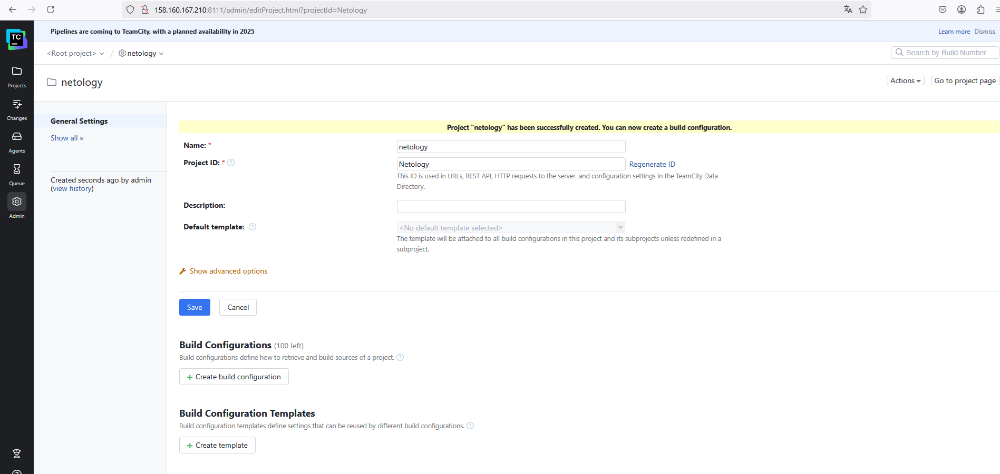

Авторизовываем агент:

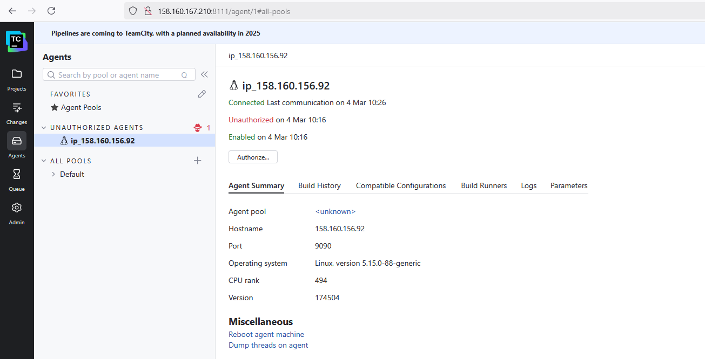

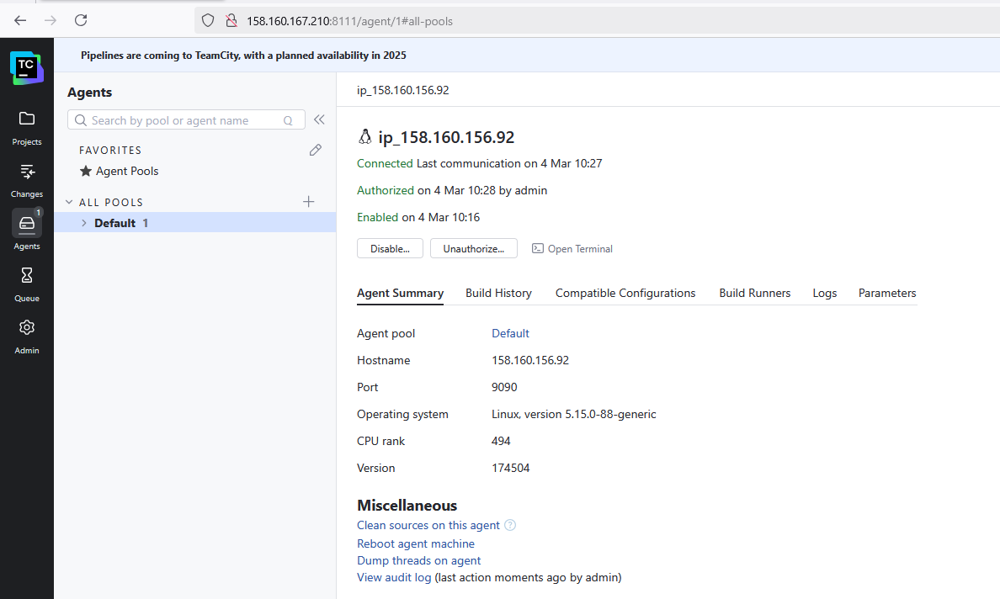

Создаем **Build Configurations** на основе fork-репозитория https://github.com/omegavlg/example-teamcity

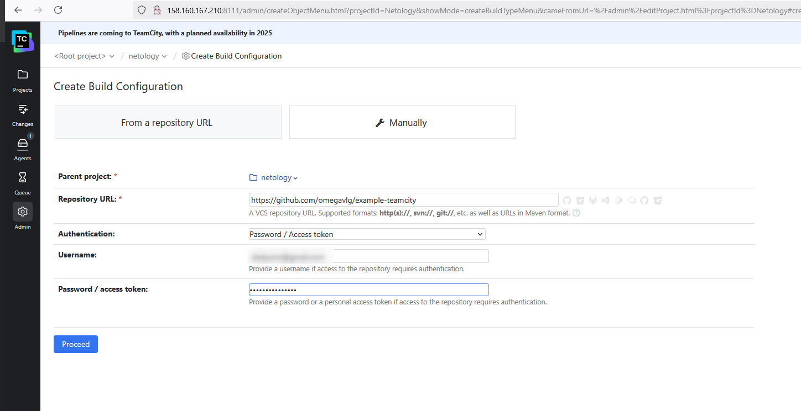

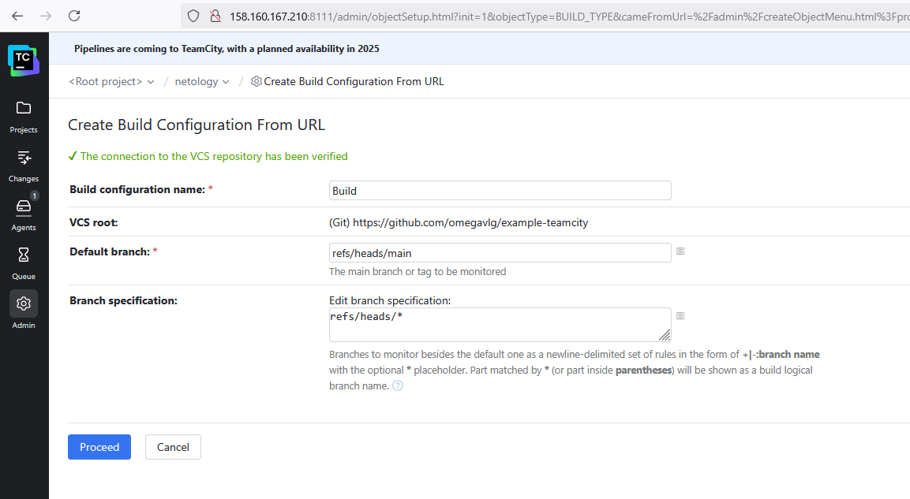

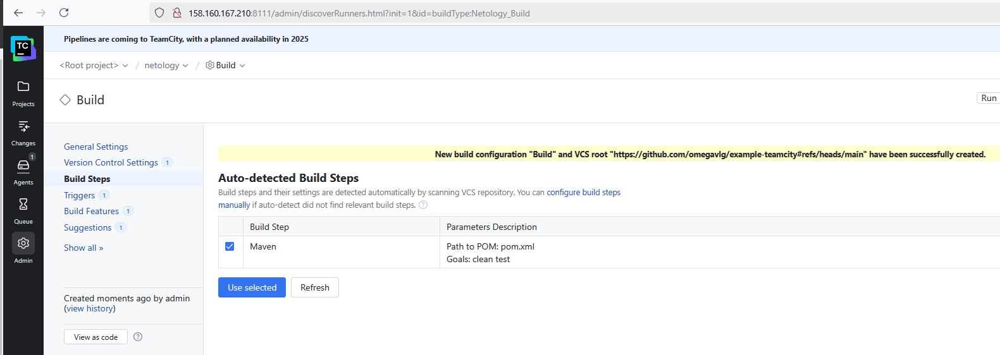

В fork проекте, в файле pom.xml меняем адрес **nexus** и выполняем первую сборку:

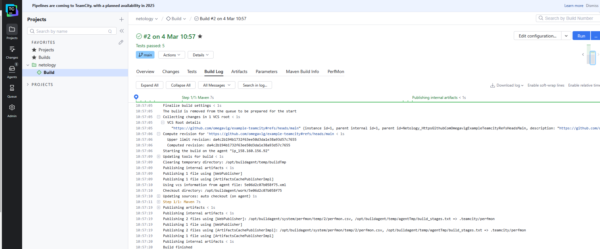

Меняем условия сборки, для того. чтобы сборка публиковалась в **nexus**

Так как в **git** в качестве **master-ветки** используется **main**, то указываем её.

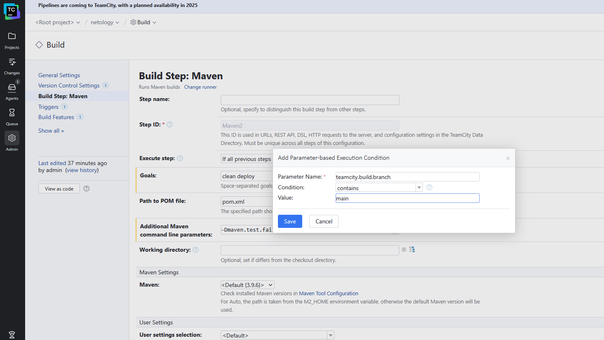

Добавляем свой конфигурационный фаайл:

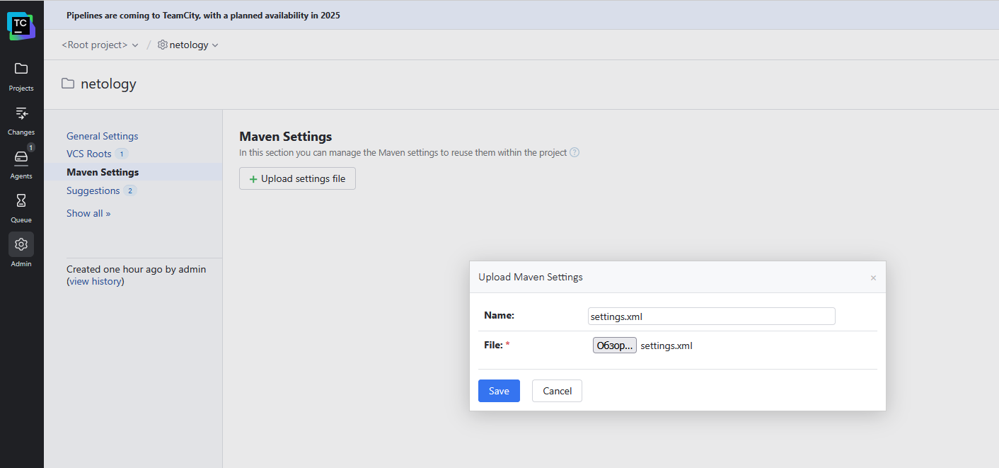

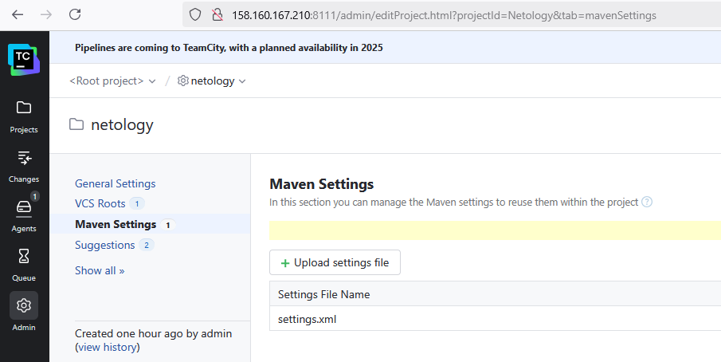

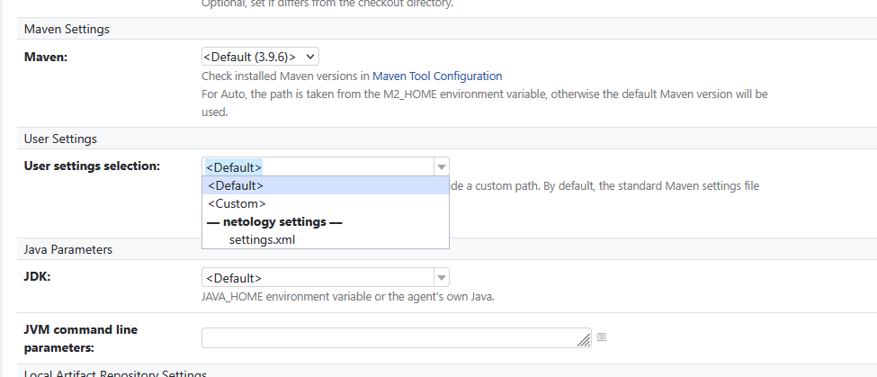

Выполняем сборку с новыми условиями:

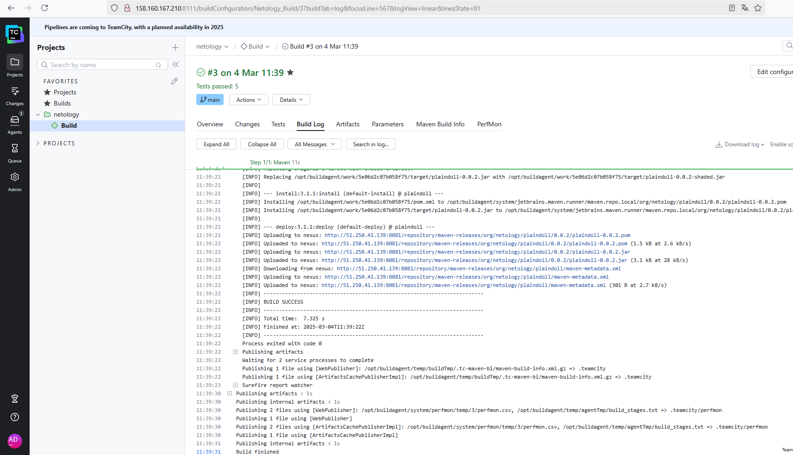

Проверяем, что наша сборка появилась в nexus:

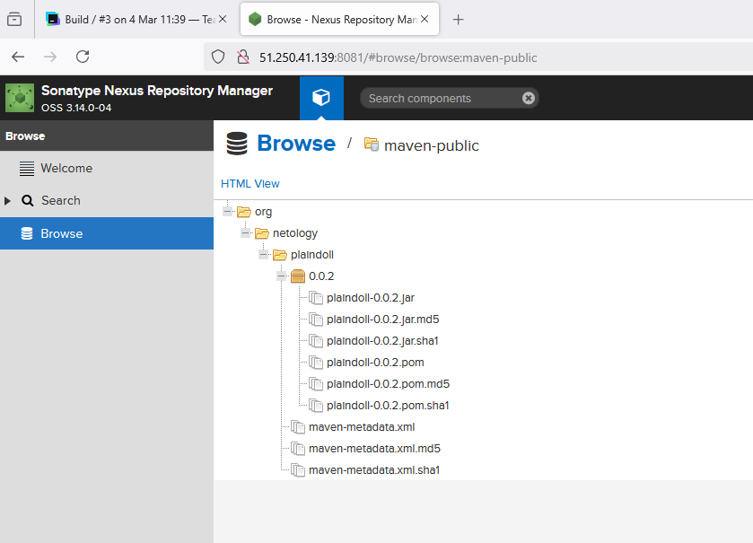

Выполняем миграцию build configuration в репозиторий.

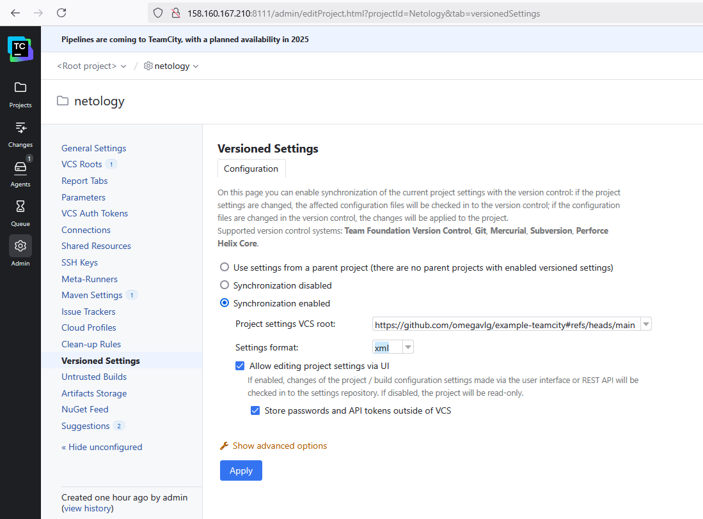

Создаем ветку **feature/add_reply** в репозитории. Добавляем новый метод для класса **Welcomer**:
```
public String getReply() {
    return "You have the heart of a hunter, brave and true.";
}
```
Дополним тест для нового метода на поиск слова **hunter** в новой реплике.
```
@Test
public void welcomerSaysReply() {
	assertThat(welcomer.getReply(), containsString("hunter"));
}
```
Сборка автоматически запустилась.

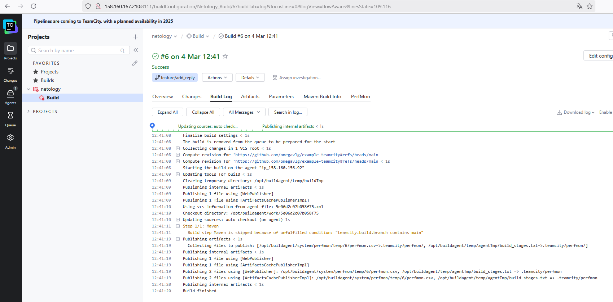

Выполняем слияние веток с помощью **merge**:
```
git checkout main
```
```
git merge feature/add_reply
```
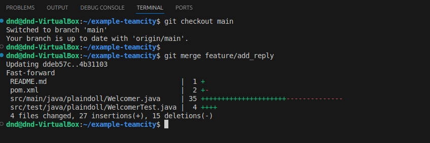

После коммита слияния, автоматически запустилась сборка и в появился артефакт с новой версией.

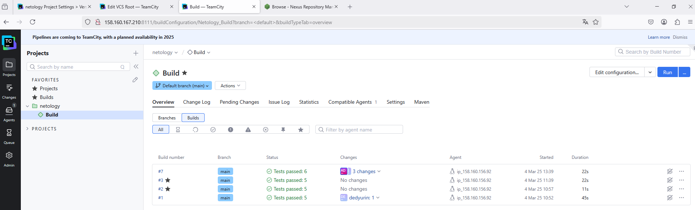
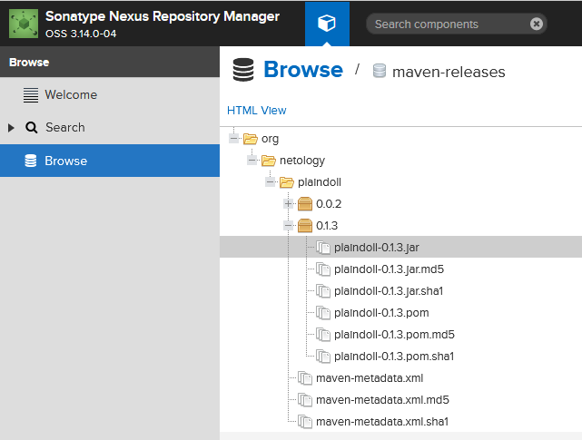


Все настройки проекта сохранены в репозитории

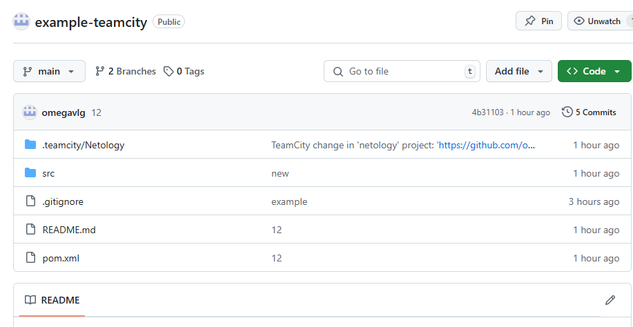